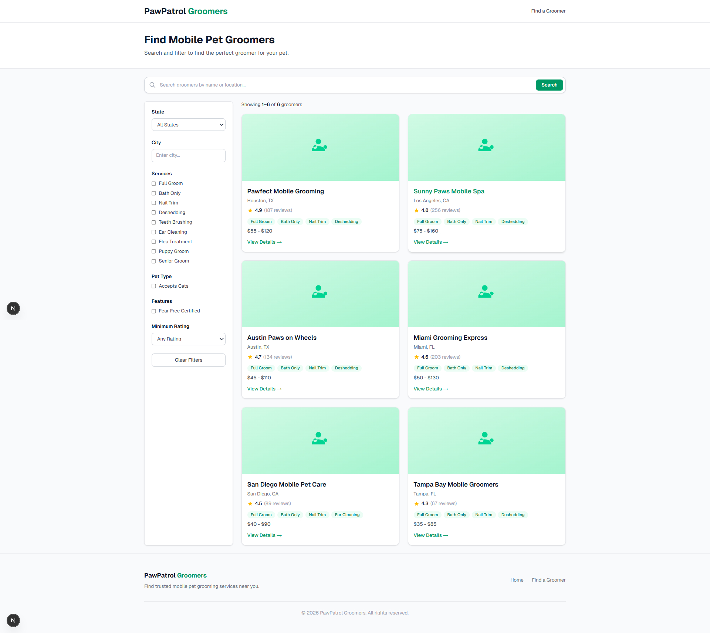

# Niche Directory Builder

<div align="center">



*Screenshot from the mock/seed data test — no Supabase required. See the [Mock Testing Guide](docs/MOCK_TESTING_GUIDE.md).*

</div>

A complete system for building niche online directories that generate organic SEO traffic and monetize through lead generation. Includes a Python data pipeline (Outscraper + Crawl4AI + Claude API) and a Next.js frontend with Supabase.

**Demo niche:** Mobile Pet Grooming (nationwide US directory)

> **Current status:** The frontend runs on **100 mock/seed listings** — no
> Supabase or API keys required. The Crawl4AI data pipeline (steps 2-8) has
> been coded but **has not been tested against live data** yet. To try the
> frontend immediately, skip to [Quick Start (Mock Mode)](#quick-start-mock-mode).
> See the [Arbitrage Demo Guide](docs/ARBITRAGE_DEMO_GUIDE.md) for a walkthrough
> of the market gap analysis features.

## How It Works

```
Raw Scrape (Outscraper)
    -> Step 2: Clean junk data
    -> Step 3: Verify niche match (Crawl4AI + Claude)
    -> Step 4: Extract services
    -> Step 5: Scrape images (optional)
    -> Step 6: Extract features
    -> Step 7: Extract service areas
    -> Step 8: Finalize + upload to Supabase
    -> Next.js frontend (browse, filter, lead capture)
```

Each pipeline step does **one enrichment type per pass** — this produces dramatically higher quality results than trying to extract everything at once.

## Project Structure

```
├── docs/                        # Documentation
│   ├── ARCHITECTURE.md          # System architecture with ASCII diagrams
│   ├── DEVELOPER_GUIDE.md       # Step-by-step developer guide
│   ├── USER_GUIDE.md            # Quick start + 12 use cases
│   └── 01-06_*.md               # Methodology reference (6 files)
├── pipeline/                    # Python data pipeline
│   ├── utils/                   # Shared helpers (crawler, LLM, CSV)
│   ├── step1_outscraper/        # Outscraper config + raw CSV storage
│   ├── step2_clean.py           # Remove junk, chains, dupes
│   ├── step3_verify.py          # Classify via website crawling (CRITICAL)
│   ├── step4_services.py        # Extract services offered
│   ├── step5_images.py          # Image scraping (optional)
│   ├── step6_features.py        # Extract business features
│   ├── step7_service_areas.py   # Extract geographic coverage
│   └── step8_finalize.py        # Validate + upload to Supabase
├── frontend/                    # Next.js 16 + TypeScript + Tailwind v4
│   ├── src/app/                 # Pages (home, browse, detail, sitemap, robots)
│   ├── src/components/          # 11 UI components (incl. MarketInsights panel)
│   └── src/lib/                 # Supabase client, queries, types
├── supabase_schema.sql          # Complete DB schema (tables, indexes, RLS, FTS)
└── CLAUDE.md                    # AI assistant project guide
```

## Documentation

| Document | Audience | Description |
|----------|----------|-------------|
| [Mock Testing Guide](docs/MOCK_TESTING_GUIDE.md) | Everyone | How to run and test with 100 seed listings (no database needed) |
| [Arbitrage Demo Guide](docs/ARBITRAGE_DEMO_GUIDE.md) | Everyone | 8 step-by-step demos showing how to find underserved markets |
| [User Guide](docs/USER_GUIDE.md) | Everyone | Quick start, 12 use cases, FAQ, cost breakdown |
| [Developer Guide](docs/DEVELOPER_GUIDE.md) | Developers | Step-by-step setup, codebase walkthrough, troubleshooting |
| [Architecture](docs/ARCHITECTURE.md) | Developers | 6-level architecture diagrams (ASCII), data flows, security model |
| [CLAUDE.md](CLAUDE.md) | AI assistants | Project conventions and guidelines for AI-assisted development |

## Tech Stack

| Layer | Technology |
|-------|-----------|
| Data scraping | [Outscraper](https://outscraper.com) (Google Maps) |
| Web crawling | [Crawl4AI](https://github.com/unclecode/crawl4ai) (AsyncWebCrawler) |
| AI classification | Claude API (Haiku for text, Vision for images) |
| Database | [Supabase](https://supabase.com) (PostgreSQL + RLS + FTS) |
| Frontend | [Next.js](https://nextjs.org) 16 + TypeScript + Tailwind CSS v4 |
| Deployment | [Vercel](https://vercel.com) |

## Quick Start (Mock Mode)

The fastest way to see the directory in action — no accounts, no API keys, no
database. Uses 100 built-in seed listings with realistic data across 22 US
states.

```bash
cd frontend
npm install
npm run dev
```

Open http://localhost:3000. You will see:
- **Homepage** with stats (100 listings, 22 states)
- **Browse page** (`/groomers`) with filters, pagination (5 pages), and a
  collapsible **Market Insights** panel that highlights service gaps
- **Detail pages** for each listing with a lead capture form

For a guided demo of the market gap analysis features, see the
[Arbitrage Demo Guide](docs/ARBITRAGE_DEMO_GUIDE.md). For details on how mock
mode works, see the [Mock Testing Guide](docs/MOCK_TESTING_GUIDE.md).

## Getting Started (Full Pipeline)

> **Note:** The Crawl4AI pipeline (steps 2-8) has been coded following the
> methodology below but has not yet been tested end-to-end with live Outscraper
> data. The frontend and mock data mode are fully tested.
>
> For the full walkthrough, see the [User Guide](docs/USER_GUIDE.md) or [Developer Guide](docs/DEVELOPER_GUIDE.md).

### 1. Set up Supabase

Create a free project at [supabase.com](https://supabase.com), then run `supabase_schema.sql` in the SQL Editor.

### 2. Configure environment

```bash
# Pipeline
cp pipeline/.env.example pipeline/.env
# Add your ANTHROPIC_API_KEY and SUPABASE_URL/SERVICE_KEY

# Frontend
cp frontend/.env.local.example frontend/.env.local
# Add your NEXT_PUBLIC_SUPABASE_URL and NEXT_PUBLIC_SUPABASE_ANON_KEY
```

### 3. Install dependencies

```bash
# Pipeline
cd pipeline
python -m venv .venv
source .venv/bin/activate  # or .venv\Scripts\activate on Windows
pip install -r requirements.txt

# Frontend
cd frontend
npm install
```

### 4. Run the pipeline

```bash
# Step 1: Manual — run Outscraper, save CSVs to pipeline/step1_outscraper/raw/
# See pipeline/step1_outscraper/README.md for queries and config

# Steps 2-8: Run sequentially, verify after each
python pipeline/step2_clean.py
python pipeline/step3_verify.py    # Most critical — verify 20 results manually
python pipeline/step4_services.py
# python pipeline/step5_images.py  # Optional
python pipeline/step6_features.py
python pipeline/step7_service_areas.py
python pipeline/step8_finalize.py  # Writes final CSV + uploads to Supabase
```

### 5. Run the frontend

```bash
cd frontend
npm run dev    # Development
npm run build  # Production build
```

### 6. Deploy

Push to GitHub, connect to Vercel, set environment variables, deploy.

## Adapting to Other Niches

This system is designed to be reused for any service-based local niche. To adapt:

1. **Change search queries** in `step1_outscraper/README.md`
2. **Update classification keywords** in `step3_verify.py`
3. **Update service categories** in `step4_services.py`
4. **Update features** in `step6_features.py`
5. **Update the frontend** branding, filters, and labels

Good niche candidates: mobile auto detailing, junk removal, ADA bathroom contractors, luxury restroom trailers, mobile notary services.

See the [User Guide](docs/USER_GUIDE.md#use-cases) for detailed walkthroughs of 12 different use cases.

## Estimated Cost

| Item | Cost |
|------|------|
| Outscraper | $5-15 |
| Claude API (Haiku, steps 3-7) | $2-5 |
| Supabase (free tier) | $0 |
| Vercel (free tier) | $0 |
| **Total** | **$7-20** |

## Acknowledgments

This project was inspired by the methodology shared by Frey Chu (Greg Isenberg podcast):
**["Claude Code built me a $273/Day online directory"](https://www.youtube.com/watch?v=I_wbc5ND79o&t=6s)**

All code and documentation in this repository were generated by [Claude Code](https://claude.ai/claude-code) powered by **Claude Opus 4.6** (Anthropic).
