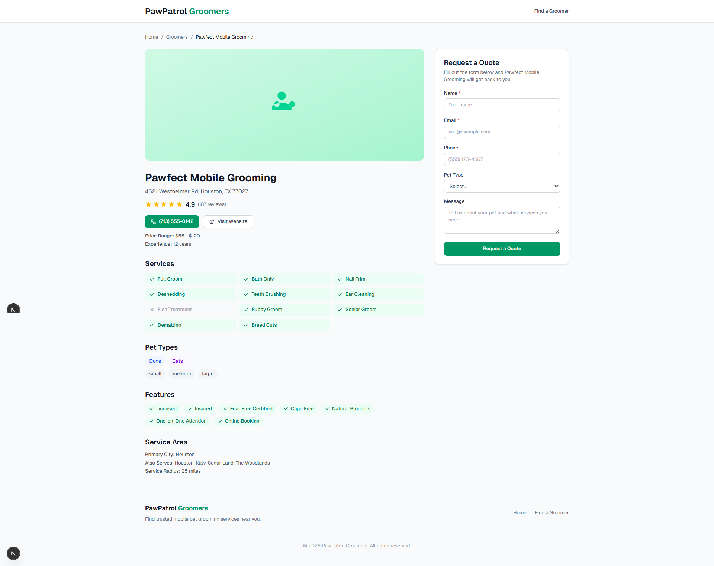
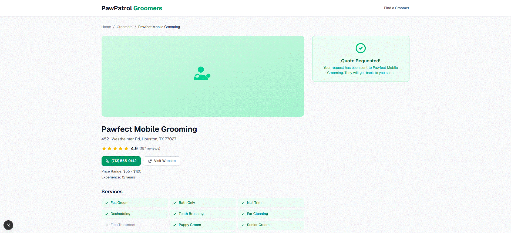

# Mock Testing Guide

How to run and test the frontend without a Supabase database, and how the mock
workflow maps to the real lead-generation business model.

---

## Table of Contents

1. [What This Project Is](#1-what-this-project-is)
2. [What Mock Mode Does](#2-what-mock-mode-does)
3. [Running in Mock Mode](#3-running-in-mock-mode)
4. [Testing the Workflow](#4-testing-the-workflow)
5. [How Mock Maps to Production](#5-how-mock-maps-to-production)
6. [Switching to Real Supabase](#6-switching-to-real-supabase)
7. [Technical Details](#7-technical-details)

---

## 1. What This Project Is

This is a **niche online directory** — think Yelp or Angi, but focused on a
single vertical (the demo niche is Mobile Pet Grooming). You are the
**directory owner**, not the groomer.

The business model is **lead-generation arbitrage**:

1. Pet owners Google "mobile pet grooming Houston"
2. Your directory ranks on Google (every listing page is SEO-optimized)
3. A pet owner lands on your site, browses groomers, and fills out "Request a Quote"
4. That lead (name, email, phone, message) goes into **your** `leads` table — you own it
5. You monetize by selling leads to groomers or charging for premium placement

The key pages:

| URL | What It Is | Your Role |
|-----|-----------|-----------|
| `/` | Homepage — "Find Mobile Pet Groomers" | Your landing page, drives SEO traffic |
| `/groomers` | Browse/search page with filters | Your search experience, keeps visitors engaged |
| `/groomer/[slug]` | Detail page about one groomer | Your listing page (not the groomer's website) |

The groomer's actual website is just a link within the listing info. The detail
page itself — the layout, the content, and especially the lead form — belongs
to you.

---

## 2. What Mock Mode Does

Normally the frontend reads listing data from Supabase (PostgreSQL) and writes
leads there. Mock mode removes that dependency so you can run `npm run dev`
immediately — no Supabase account, no database setup, no environment variables.

Mock mode provides:

- **6 realistic seed listings** across 3 states (TX, CA, FL) with varied
  services, ratings, prices, and features
- **In-memory filtering** that mirrors the real Supabase queries (state, city,
  search, services, rating, pagination)
- **Lead form submission** that logs to the browser console instead of writing
  to a database

Auto-detection is automatic: if `NEXT_PUBLIC_SUPABASE_URL` is empty or contains
`"placeholder"`, mock mode activates. No code changes or flags needed.

---

## 3. Running in Mock Mode

```bash
cd frontend

# Make sure there is no .env.local, or that it has no NEXT_PUBLIC_SUPABASE_URL
# If you have one with real credentials, temporarily rename it:
mv .env.local .env.local.bak

# Install dependencies (first time only)
npm install

# Start dev server
npm run dev
```

Open `http://localhost:3000`. You should see the directory homepage with 6
listings and 3 states.

---

## 4. Testing the Workflow

Though this uses seed data, the mock test exercises the same filtering and
lead-generation components as the production workflow. Here is what to verify:

### 4a. Homepage

Visit `http://localhost:3000`.

- Stats should show 6 listings across 3 states
- Navigation links to the browse page work

### 4b. Browse Page — Filtering

Visit `http://localhost:3000/groomers`.

- **State dropdown**: Select "TX" — should show 2 listings (Houston, Austin).
  Select "FL" — should show 2 (Miami, Tampa).
- **City search**: Type "houston" in the city field — should narrow to 1 listing.
- **Service checkboxes**: Toggle services like "Flea Treatment" — listings
  without that service disappear.
- **Accepts Cats**: Toggle on — listings that are dogs-only disappear
  (Austin Paws on Wheels and Miami Grooming Express are dogs-only).
- **Fear Free Certified**: Toggle on — only 2 listings remain (Houston and
  Los Angeles).
- **Minimum Rating**: Set to 4.7 — filters out lower-rated groomers.
- **Combined filters**: Stack multiple filters to verify they work together.
- **URL sync**: Check that the browser URL updates with query parameters as you
  filter (e.g., `/groomers?state=TX&city=houston`). Pasting that URL back
  should restore the same filters.

### 4c. Detail Page

Click any listing card, or visit a URL directly like:

```
http://localhost:3000/groomer/pawfect-mobile-grooming-houston
```

- Listing details render (name, address, phone, services, features, rating)
- The "Request a Quote" form is visible on the right



### 4d. Lead Form Submission

This is the core monetization component. On any detail page:

1. Fill out the "Request a Quote" form (name, email, etc.)
2. Click "Request a Quote"
3. The form should show a green success message ("Quote Requested!")
4. Open your **browser DevTools** (F12 or right-click > Inspect > Console tab)
5. You should see: `[MOCK] Lead submitted: {listing_id: 1, name: "...", email: "...", ...}`

In production, this data writes to the `leads` table in Supabase. In mock mode,
it logs to the browser console so you can verify the form works end-to-end
without a database.



### 4e. Build Verification

```bash
npm run build
```

This should succeed and generate static pages for all 6 seed listings. The
output will show routes like:

```
● /groomer/[slug]
  ├ /groomer/pawfect-mobile-grooming-houston
  ├ /groomer/austin-paws-on-wheels
  ├ /groomer/sunny-paws-mobile-spa-los-angeles
  └ [+3 more paths]
```

---

## 5. How Mock Maps to Production

| Mock Behavior | Production Behavior |
|--------------|-------------------|
| 6 seed listings in memory | Thousands of listings in Supabase |
| In-memory array filtering | Supabase SQL queries with indexes |
| `console.log` on lead submit | `INSERT INTO leads` via Supabase API |
| Static pages from seed slugs | Static pages from real slugs via `generateStaticParams` |
| Instant responses | Network latency to Supabase |

The UI components, page structure, filter logic, URL parameter syncing, form
validation, and page routing are **identical** between mock and production.
Mock mode only swaps the data layer.

---

## 6. Switching to Real Supabase

1. Create a Supabase project and run `supabase_schema.sql` in the SQL Editor
2. Run the data pipeline (`pipeline/step2-8`) to populate listings
3. Create `frontend/.env.local`:

```
NEXT_PUBLIC_SUPABASE_URL=https://your-project.supabase.co
NEXT_PUBLIC_SUPABASE_ANON_KEY=eyJ...your-anon-key...
```

4. Restart the dev server — mock mode deactivates automatically

---

## 7. Technical Details

### How Auto-Detection Works

In `frontend/src/lib/queries.ts`:

```ts
const supabaseUrl = process.env.NEXT_PUBLIC_SUPABASE_URL ?? '';
export const IS_MOCK = !supabaseUrl || supabaseUrl.includes('placeholder');
```

Every query function checks `IS_MOCK` first. If true, it operates on the seed
array in `frontend/src/lib/seed-data.ts`. If false, it queries Supabase as
normal.

### Files Involved

| File | Role |
|------|------|
| `frontend/src/lib/seed-data.ts` | 6 seed `Listing` objects |
| `frontend/src/lib/queries.ts` | All data access — mock branch + real Supabase branch |
| `frontend/src/lib/supabase.ts` | Supabase client (still uses placeholder fallback for builds) |

### Seed Listings Summary

| # | Name | City | State | Rating | Cats | Fear Free |
|---|------|------|-------|--------|------|-----------|
| 1 | Pawfect Mobile Grooming | Houston | TX | 4.9 | Yes | Yes |
| 2 | Austin Paws on Wheels | Austin | TX | 4.7 | No | No |
| 3 | Sunny Paws Mobile Spa | Los Angeles | CA | 4.8 | Yes | Yes |
| 4 | San Diego Mobile Pet Care | San Diego | CA | 4.5 | Yes | No |
| 5 | Miami Grooming Express | Miami | FL | 4.6 | No | No |
| 6 | Tampa Bay Mobile Groomers | Tampa | FL | 4.3 | Yes | No |
